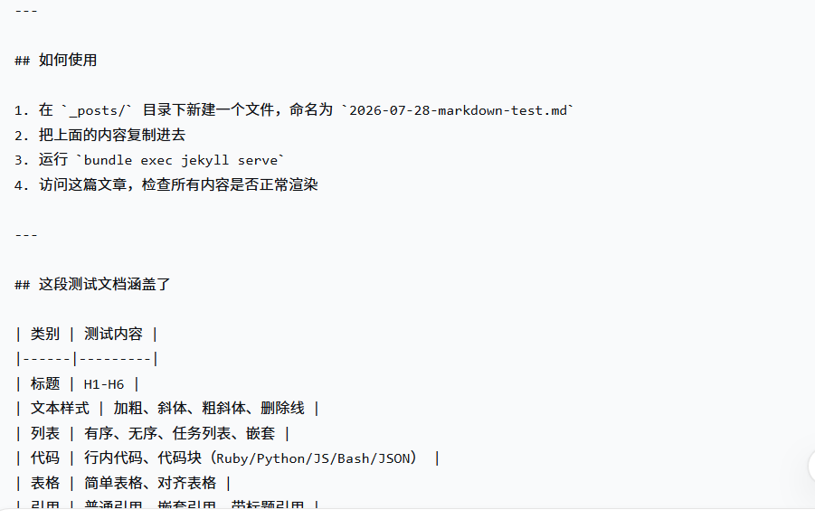

这是一篇用于测试的通用文档，涵盖Markdown核心语法、扩展语法、代码高亮、数学公式、Mermaid图表、图片、表格、列表以及Giscus评论渲染。

---

## 1. 标题与段落

# H1 一级标题
## H2 二级标题
### H3 三级标题
#### H4 四级标题
##### H5 五级标题
###### H6 六级标题

这是一段普通段落。Lorem ipsum dolor sit amet, consectetur adipiscing elit, sed do eiusmod tempor incididunt ut labore et dolore magna aliqua.

这是另一段，用于测试段落之间的**间距**和 *斜体* 以及 ***粗斜体*** 的渲染。

你也可以使用 `code` 内联代码。

---

## 2. 列表

### 无序列表
- 项目 1
- 项目 2
  - 缩进项目 2.1
  - 缩进项目 2.2
    - 再缩进项目 2.2.1
- 项目 3

### 有序列表
1. 第一项
2. 第二项
   1. 子项 2.1
   2. 子项 2.2
3. 第三项

### 任务列表 (Task List)
- [x] 已完成任务
- [ ] 未完成任务
- [ ] 另一个待办

### 混合列表
- 无序项目
  1. 有序子项 1
  2. 有序子项 2
    - 更深的无序列表
    - 第二项
- 继续外层列表

---

## 3. 代码与语法高亮

### 行内代码
`<div>这是一个行内代码</div>`

### 代码块 (Fenced Code Blocks)

#### Ruby
```ruby
def hello_world(name)
  puts "Hello, #{name}!"
  return true
end

# 这是注释
hello_world("Wen Gao")
```

#### Python
```python
def calculate_sum(numbers):
    total = 0
    for num in numbers:
        total += num
    return total

print(calculate_sum([1, 2, 3, 4, 5]))
```

#### JavaScript
```javascript
const fetchData = async () => {
  const response = await fetch('/api/data');
  const data = await response.json();
  console.log(data);
};
fetchData();
```

#### Shell/Bash
```bash
#!/bin/bash
echo "Hello, World!"
ls -la | grep ".md"
```

#### JSON
```json
{
  "name": "Wen Gao",
  "age": 18,
  "tags": ["blog", "jekyll", "markdown"]
}
```

---

## 4. 表格

### 简单表格

| 水果   | 价格 | 数量 |
|--------|------|------|
| 苹果   | ¥5   | 10   |
| 香蕉   | ¥3   | 20   |
| 橙子   | ¥4   | 15   |
| 总计   |      | 45   |

### 带对齐的复杂表格

| 左对齐 | 居中对齐 | 右对齐 |
|:-------|:--------:|-------:|
| 苹果   | 5元      | 10     |
| 香蕉   | 3元      | 20     |
| 橙子   | 4元      | 15     |
| 合计   |          | **45** |

---

## 5. 引用

### 普通引用
> 这是一个普通的引用块。
> 它通常用于展示重要的引言或提示。

### 嵌套引用
> 这是外层引用。
>> 这是内层引用，用于多级嵌套。
>
> 回到外层。

### 带标题的引用块 (Blockquote with Title)
> 这里是一段引用的内容，引用了Jekyll文档的一句话。
> <footer>Jekyll 官方文档</footer>

---

## 6. 链接与图片

### 超链接
- [GitHub](https://github.com)
- [Jekyll 官方文档](https://jekyllrb.com)
- [文内锚点跳转](#1-标题与段落)

### 图片 (带标题)




---

## 7. 数学公式 (MathJax / KaTeX)

### 行内公式
爱因斯坦质能方程：$E = mc^2$ 是物理学最著名的公式。

欧拉恒等式：$e^{i\pi} + 1 = 0$

### 独立公式

$$
\frac{-b \pm \sqrt{b^2 - 4ac}}{2a}
$$

### 复杂公式

$$
\int_{0}^{\infty} e^{-x^2} dx = \frac{\sqrt{\pi}}{2}
$$

矩阵：

$$
\begin{bmatrix}
a & b \\
c & d
\end{bmatrix}
$$

---

## 8. Mermaid 图表

### 流程图


graph TD;
    A[开始] --> B{是否继续?};
    B -->|是| C[执行操作];
    C --> D[结束];
    B -->|否| D;


### 时序图

sequenceDiagram
    participant 用户
    participant 博客
    participant 数据库
    用户->>博客: 访问文章
    博客->>数据库: 请求数据
    数据库-->>博客: 返回数据
    博客-->>用户: 显示文章


### 饼图

pie title 技术栈分布
    "Ruby" : 30
    "Jekyll" : 25
    "JavaScript" : 20
    "CSS" : 15
    "其他" : 10


---

## 9. 扩展语法

### 删除线
~~这是被删除的文字~~，这是正常文字。

### Emoji
:smile: :heart: :rocket: :+1: :100: :fire:

### 脚注
这里是一个脚注示例[^1]，另一个脚注[^2]。

[^1]: 这是第一个脚注的内容。
[^2]: 这是第二个脚注的内容。

---

## 10. HTML 内联混用

<p style="color: red; font-weight: bold;">这是直接用 HTML 写的红色加粗文字。</p>

<div style="background-color: #f0f0f0; padding: 10px; border-radius: 8px;">
  <p>这是一个带背景和圆角的 DIV 容器。</p>
  <ul>
    <li>列表项 A</li>
    <li>列表项 B</li>
  </ul>
</div>

---

## 11. 结语与总结

测试内容包括：
- ✅ 标题层级
- ✅ 段落与文本样式
- ✅ 有序/无序/任务列表
- ✅ 多种编程语言代码高亮
- ✅ 简单/复杂表格
- ✅ 普通/嵌套引用
- ✅ 链接与图片
- ✅ 行内/多行数学公式
- ✅ Mermaid 流程图/时序图/饼图
- ✅ Emoji 与扩展语法
- ✅ HTML 混用

如果以上所有内容都能正常渲染，那么你的博客 Markdown 渲染、代码高亮、数学公式、图表、评论系统就全部正常工作了。

---

**测试结束！**